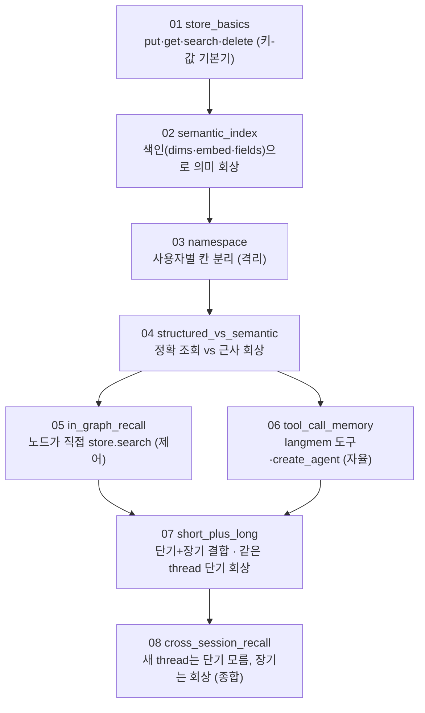
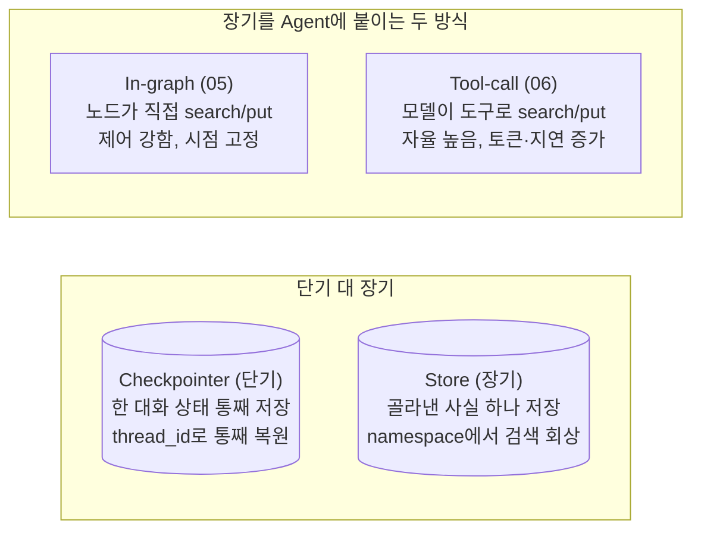

# 08. Agent 장기 메모리와 회상

기본 Agent는 호출이 끝나면 맥락을 잊습니다. 앞 장에서 단기 메모리(checkpointer)로 한 대화 안의 흐름을 이었다면, 이 장은 대화를 넘어 사용자를 기억하는 장기 메모리를 다룹니다. Store에 사실 하나를 저장하고(put), 키로 정확히 꺼내고(get), 키를 몰라도 의미가 가까운 기억을 회상하며(search), 사용자별로 칸을 나눠 기억이 섞이지 않게 분리하고, 그 장기 메모리를 Agent에 붙이는 두 방식(노드가 직접 회상 vs 모델이 도구로 회상)을 거쳐, 새 세션에서도 기억이 떠오르는 교차 세션 회상까지 다룹니다.

이 장은 **하나의 주제마다 독립 실행 파일 하나**로 구성됩니다. 각 `NN_topic.py`는 자기완결이라 단독으로 실행되며, 짝이 되는 `NN_topic.md`가 그 예제만으로 혼자 학습할 수 있는 설계·구동 원리를 담습니다. 번호 순서대로 따라가면 Store 기초에서 교차 세션 회상까지 개념이 점점 쌓입니다.

## 학습 목표

- 단기 메모리(checkpointer)와 장기 메모리(Store)를 저장 단위·꺼내는 방식으로 구분해 설명할 수 있다.
- `InMemoryStore`의 네 연산 `put`·`get`·`search`·`delete`로 기억을 쓰고, 정확히 꺼내고, 둘러보고, 지울 수 있다.
- 임베딩 색인(시맨틱 인덱스)을 켜서, 키를 몰라도 의미가 가까운 기억을 회상할 수 있다.
- `namespace`를 사용자별로 나눠 기억을 격리하고, 구조형 기억과 시맨틱 기억을 상황에 맞게 골라 쓸 수 있다.
- 장기 기억을 Agent에 붙이는 두 방식 — In-graph(노드가 직접 회상)와 Tool-call(모델이 langmem 도구로 회상) — 의 차이를 제어 대 자율의 축으로 비교할 수 있다.
- 단기와 장기를 함께 장착해, 새 세션(thread)에서 직전 대화는 모르지만 장기 기억은 회상하는 Agent를 만들 수 있다.

## 실행 방법

```bash
# 레포 루트(ai-agent-dev-lgens)에서
uv sync                       # 최초 1회 (의존성 설치)
cp .env.example .env          # 최초 1회, .env에 OPENAI_API_KEY 입력

# 예제는 하나씩 단독으로 실행합니다.
uv run python 08_long_memory/01_store_basics.py
uv run python 08_long_memory/02_semantic_index.py
# ... 08까지 같은 방식
```

각 파일은 상단에 `load_dotenv()`·`MODEL`/`EMBED` 상수·필요한 import·자체 초기화를 모두 갖춰, 다른 파일에 의존하지 않습니다. `01_store_basics.py`는 색인을 켜지 않아 임베딩 호출이 없으므로 **키 없이도 동작**하고, 나머지(02~08)는 임베딩·모델 호출을 쓰므로 키가 필요합니다. 키가 없으면 안내만 출력하고 종료하므로, 문법·import 점검은 키 없이도 됩니다.

이 장은 모델 호출과 함께 **임베딩 호출**도 사용합니다. 주 모델은 `openai:gpt-5.4-mini`, 임베딩은 `openai:text-embedding-3-small`(1536차원)을 쓰며, 둘 다 같은 `OPENAI_API_KEY`를 사용합니다. 모델명과 가격은 실행 직전에 다시 확인하십시오.

## 권장 학습 경로

번호 순서대로 보는 것을 권장합니다. 각 예제는 `NN_topic.py`(코드)와 `NN_topic.md`(설계·원리)가 짝을 이룹니다.

| 번호 | 예제 | 한 줄 요약 |
|------|------|-----------|
| 01 | `01_store_basics` | Store 네 연산 `put`·`get`·`search`·`delete` (색인 없는 키-값, 키 없이 실행) |
| 02 | `02_semantic_index` | 시맨틱 인덱스(`dims`·`embed`·`fields`)로 의미 기반 회상·`score`·`limit` |
| 03 | `03_namespace` | `namespace` 첫 칸을 사용자 ID로 나눠 기억 격리 |
| 04 | `04_structured_vs_semantic` | 구조형 기억(키로 정확 조회) vs 시맨틱 기억(자연어 근사 회상) |
| 05 | `05_in_graph_recall` | In-graph 방식 — 노드가 직접 `store.search`·방어적 읽기 |
| 06 | `06_tool_call_memory` | Tool-call 방식 — langmem 도구 + `create_agent`로 모델이 자율 저장·회상 |
| 07 | `07_short_plus_long` | 단기(checkpointer) + 장기(Store) 결합, 같은 thread 단기 회상 |
| 08 | `08_cross_session_recall` | 교차 세션 회상 — 새 thread는 단기 모름, 장기는 회상 (종합) |

01~04가 Store 자체를 다루는 기본기와 회상의 두 성격(구조형·시맨틱)이고, 05~06이 장기 기억을 Agent에 붙이는 두 방식, 07~08이 단기·장기를 함께 다루는 종합입니다.

## 챕터 전체 흐름 (다이어그램)

번호를 따라가면 Store 기초 위에 시맨틱 회상·사용자 분리·Agent 결합·교차 세션 회상이 차례로 쌓입니다.



## 단기 대 장기, In-graph 대 Tool-call (구조 비교)

이 장을 가르는 두 축을 한눈에 둡니다.



## 핵심 점검

이 장이 성공인지 가르는 한 가지 기준은 **`08_cross_session_recall`에서 새 thread(session-B)인데도 등산 기억이 회상되는지**입니다. 직전 점심 대화(단기)는 모르면서 등산 선호(장기)는 떠올린다면, 단기와 장기의 차이를 몸으로 이해한 것입니다.

- **저장 단위가 다르다.** Checkpointer는 한 대화의 상태를 통째로 저장했다 통째로 복원하고, Store는 골라낸 사실 하나를 저장했다 검색으로 회상합니다. "이 기억이 한 대화 안에서만 필요한가, 대화를 넘어 떠올려야 하는가"가 두 메모리를 가르는 질문입니다.
- **회상의 열쇠가 다르다.** 단기는 `thread_id`로 대화를 가르고, 장기는 `namespace`로 지식을 가릅니다. `03_namespace`에서 같은 키(`pref`)·같은 query인데 앤디 칸과 보라 칸 결과가 갈리면, 네임스페이스 격리가 동작한 것입니다.
- **의미 회상에는 색인이 필요하다.** 색인을 켜지 않은 기본 `InMemoryStore`의 `search`는 의미적 유사도로 정렬하지 못하고 항목을 그대로 돌려주는 데 그칩니다(`01_store_basics`). `02_semantic_index`에서 `index=`로 임베딩 색인을 켜야 "단어가 안 겹쳐도 의미로 회상"이 동작합니다.
- **구조형과 시맨틱은 쓰임이 다르다.** 환경설정·프로필처럼 값이 명확한 정보는 구조형(키로 정확 조회·갱신)으로, 대화 중 알게 된 흐릿한 취향은 시맨틱(자유 문장·자연어 검색)으로 다룹니다. 실무에서는 둘을 함께 씁니다.
- **저장·회상의 주체가 다르다.** In-graph는 개발자 코드가, Tool-call은 모델 도구가 회상·저장을 주도합니다. "제어 대 자율"이 두 방식을 가르는 축입니다.

## 흔한 실수 (증상별 진단)

| 증상 | 원인 | 해결 |
|------|------|------|
| `search`에 query를 줘도 의미로 정렬되지 않는다 | 색인 없는 기본 `InMemoryStore` | `index={dims, embed, fields}`로 시맨틱 인덱스 켜기 |
| 의미 회상 결과가 엉뚱하거나 비어 있다 | dims가 임베딩 모델 차원과 안 맞음 | `dims`를 임베딩 모델 출력 차원(1536)에 맞추기 |
| 다른 사용자의 기억이 섞여 나온다 | 네임스페이스를 사용자별로 안 나눔 | `namespace` 첫 칸을 사용자 ID로 분리 |
| In-graph 회상에서 `KeyError`가 난다 | 값에서 `r.value['text']`로 직접 접근 | `text → content → str(value)` 순으로 방어적 읽기 |
| Tool-call Agent 구성이 안 된다 | `create_react_agent`를 씀 | `from langchain.agents import create_agent` 사용 |
| 새 thread인데 직전 대화를 기억할 거라 기대한다 | 단기 메모리는 thread별로 격리됨 | 대화를 넘는 정보는 장기 메모리(Store)에 두기 |
| 짧은 대화에 응답이 느리고 복잡하다 | 처음부터 모든 것을 검색 회상으로 몰아넣음 | 짧으면 보존, 길어지면 요약, 넘나들면 검색 순으로 하나씩 더하기 |
| 재시작하니 기억이 모두 사라진다 | `InMemorySaver`·`InMemoryStore`는 프로세스 메모리에 저장 | 운영에서는 `PostgresSaver`·`PostgresStore`로 교체 |

> 막힘은 대부분 모델 탓이 아니라 위 패턴입니다. 더 큰 모델로 바꾸기 전에 증상을 표에서 역추적하십시오.

## 더 해보기

- `02_semantic_index`의 `limit`를 키우거나 줄여 보십시오. 키우면 덜 관련된 기억까지 끌려와 노이즈가 늘고, 줄이면 회상이 빈약해집니다. 회상 개수는 품질과 토큰의 트레이드오프입니다.
- `03_namespace`에 `("user-123", "preferences")`와 `("user-123", "history")`처럼 같은 사용자 안에서 주제 칸을 더 나눠, 선호만 검색할 때 이력이 딸려 오지 않게 해 보십시오.
- `05_in_graph_recall`(In-graph)과 `06_tool_call_memory`(Tool-call)를 같은 질문으로 번갈아 실행해, 어느 쪽이 언제 저장·회상하는지를 직접 비교해 보십시오.
- 운영을 가정해 `InMemoryStore`를 `PostgresStore`로, `InMemorySaver`를 `PostgresSaver`로 바꾸면 어떤 설정이 추가로 필요한지 공식 문서로 확인해 보십시오.

## 마무리·정리

이 장으로 실습 과정이 마무리됩니다. 표준 인터페이스로 모델을 부르는 것(02)에서 출발해, 도구 호출(03)과 그래프(05~06)를 거쳐, 마지막으로 대화를 넘어 사용자를 기억하는 장기 메모리까지 쌓아 올렸습니다. 지금까지의 부품을 하나로 모으면, 도구로 외부와 상호작용하고 그래프로 흐름을 제어하며 단기·장기 메모리로 맥락과 지식을 이어 가는 Agent가 됩니다.

다음 학습 경로는 두 갈래입니다. 하나는 **회상 전략의 심화**입니다. 이 장에서 검색 회상을 다뤘다면, 긴 대화의 단기 메모리를 다루는 전체 보존·요약 압축과 어떻게 층을 이루는지(짧으면 보존, 길어지면 요약, 넘나들면 검색)를 직접 설계해 보십시오. 다른 하나는 **운영으로의 이행**입니다. 데모용 인메모리 백엔드를 Postgres 기반으로 교체하고, 네임스페이스와 색인을 실제 사용자 규모에 맞게 설계하면, 실습에서 만든 Agent를 현장에 올리는 길이 열립니다. 마지막으로, 오늘 배운 도구·그래프·메모리를 본인 도메인의 업무 하나에 어떻게 적용할지를 한 장의 설계로 그려 보는 것이 가장 좋은 복습입니다.
